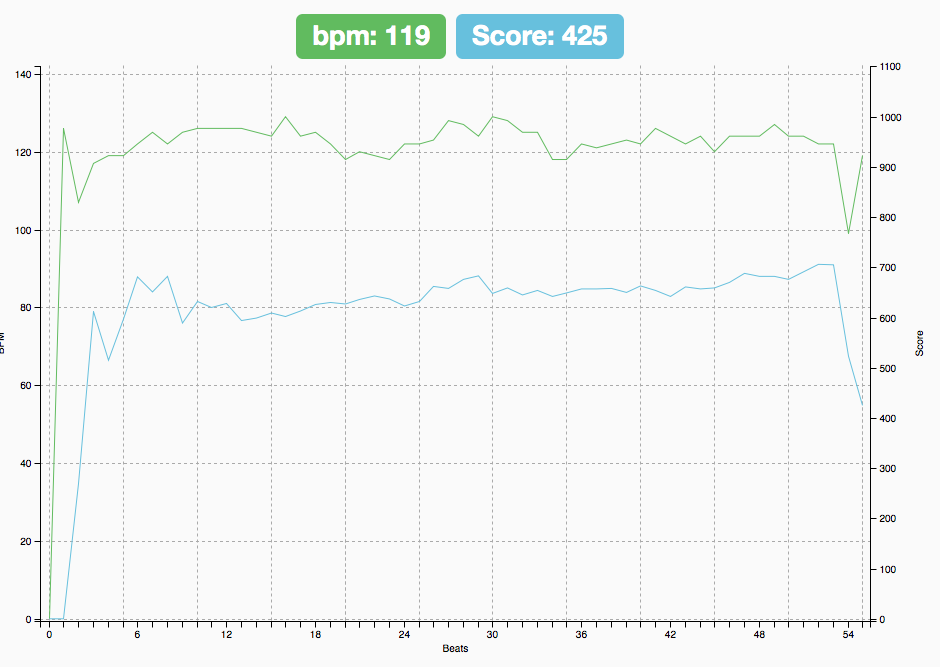

# Bpm Tracker
Measure and plot your ability to tap consistent tempos.

Written in javascript and HTML. Uses D3.js and charting library C3.js.

Running here:  
http://www.richard-stanton.com/music/bpm-tracker/

## Screenshot

